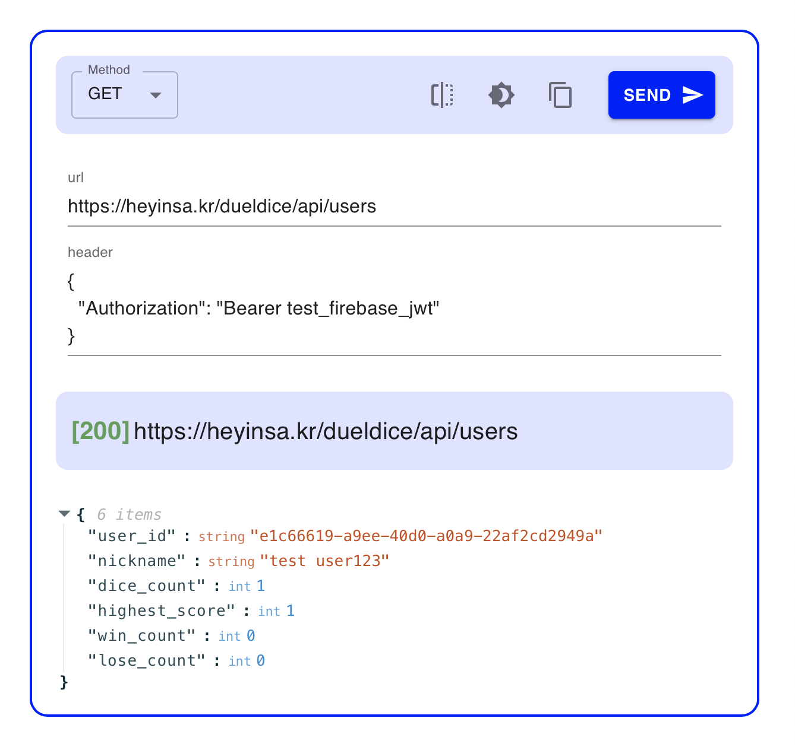
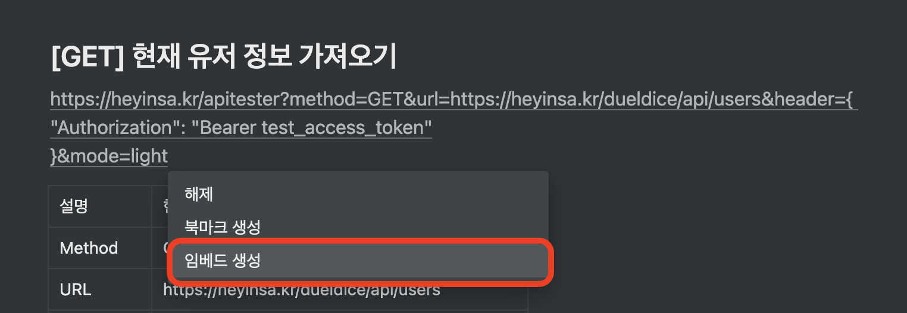

# APITester_For_Notion

APITester_For_Notion은 API 문서를 Notion으로 작성할 때, Notion 내에서 Embeding Block으로 사용할 수 있는 오픈소스 입니다. Embeding Block을 사용할 수 있는 플랫폼이라면, Notion이 아니라도 사용가능 합니다. 현재 제공되는 Theme은 Notion을 기준으로 제작되었습니다.



**Easy to Use, Beautiful Design!**

</br>
</br>

# Demo

아래 링크에서 Demo 버전을 사용해 보세요!

👉 [Demo Link](https://heyinsa.kr/apitester?method=GET&url=https://heyinsa.kr/dueldice/api/users&header=%7B%0A%20%20%22Authorization%22:%20%22Bearer%20test_firebase_jwt%22%0A%7D&mode=light&present=)

아래 링크에서 실제 사용 예시를 확인해 보세요!

👉 [Notion Link](https://80000coding.notion.site/DDIP-API-v1-631226749606492ea2a039d72b6eb0ee)


</br>
</br>

# Feature

- Notion등 Embeding Block이 사용가능한 서비스 에서 사용가능 합니다.
- QueryString을 사용해서 포멧이 적용된 블록을 다양하게 생성할 수 있습니다.
- 오픈소스 라이브러리 입니다.

</br>
</br>

# Usage

| props  | optional? | default | value?                                                                                                                                                                                  |
| ------ | --------- | ------- | --------------------------------------------------------------------------------------------------------------------------------------------------------------------------------------- |
| mode   | optional  | light   | 기본값은 라이트모드, mode 옵션을 통해서 APITester Block의 기본 테마를 지정할 수 있습니다.                                                                                               |
| method | optional  | get     | 특정 API에서 사용하는 HTTP메소드를 APITester Block의 기본 메서드로 지정할 수 있습니다. 메서드가 설정되어 있지 않다면 Send버튼이 동작하지 않습니다. get, post, put, delete를 제공합니다. |
| url    | -         | -       | 테스트를 진행하고 싶은 API를 입력합니다, URL이 입력되지 않으면 Send 버튼이 동작하지 않습니다.                                                                                           |
| body   | optional  | -       | body로 넘길 json형식의 문자열을 입력합니다.                                                                                                                                             |
| header | optional  | -       | header로 넘길 key=value형식의 문자열을 입력합니다.                                                                                                                                      |

</br>
</br>

# Example

## URL을 만드는 방법

url을 생성하는 방법입니다. 노션에 해당 url을 붙여넣은 후, 임베드 시켜주세요 :)


### Method

```text
https://heyinsa.kr/apitester/?method=get
https://heyinsa.kr/apitester/?method=post
```

### URL

```
https://heyinsa.kr/apitester/?url=your_api_url
```

### Theme

```
https://heyinsa.kr/apitester/?mode=dark
https://heyinsa.kr/apitester/?mode=light
```

### Multy Query

```
https://heyinsa.kr/apitester/?mode=dark&method=get&url=your_api_url&header={"key":"valye"}
```

</br>
</br>

# Keywords

- API
- React
- Notion

